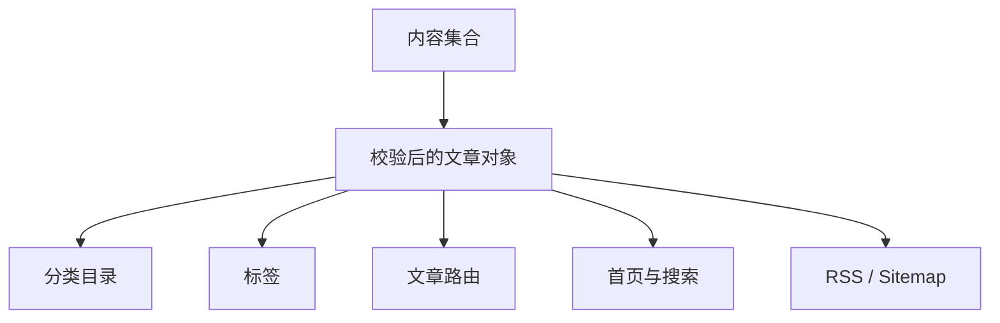

## 摘要

一篇文章能否被访问，不只取决于文件是否存在。它还必须通过元数据校验、获得稳定 slug、进入排序与分组，并被目录、搜索或订阅入口发现。本文以本站内容集合为对象，说明单一数据源如何驱动多个视图，并分析顺序、链接与分类维护中的常见错误。

**关键词：** 内容集合；frontmatter；slug；分类；信息检索

## 1. 从“文件”到“内容实体”

本站文章位于 `src/content/blog`，由 [`src/content.config.ts`](https://github.com/ice11123/blog_test2/blob/main/src/content.config.ts) 中的 glob loader 读取。每篇 Markdown/MDX 顶部的 frontmatter 必须满足 schema：标题、描述和发布日期为基础字段，作者、源地址、封面可选，`dir1`、`dir2` 与标签负责组织内容。

```yaml
title: "02｜内容模型、路由与发现机制"
description: "文章摘要"
pubDate: "2026-09-29"
author: "离子怪"
dir1: "AI/Agent协作与开发"
dir2: "网站开发与维护"
tags: ["内容模型", "路由"]
```

schema 的价值是把拼写或类型错误提前到构建阶段。例如 `sourceUrl` 不仅要是合法 URL，还必须以 GitHub HTTPS 地址开头；错误不会悄悄进入线上卡片。

## 2. 单一数据源如何产生多种页面

[`src/lib/blogData.ts`](https://github.com/ice11123/blog_test2/blob/main/src/lib/blogData.ts) 与相关工具集中完成文章读取、分类和排序。相同集合随后服务于：

- `/blog/` 总目录；
- `/blog/category/...` 分级目录；
- `/blog/tags/...` 标签筛选；
- `/blog/[...slug]` 文章正文；
- 首页近期文章与技术星图；
- 搜索索引、RSS 与站点地图。



这比在每个页面重新扫描文件更可靠：排序与缺省值只定义一次，各页面看到的是同一套事实。

## 3. 路由与 slug

文章 slug 来自内容文件相对于集合根目录的路径。本文的源码路径包含两个中文目录，最终 URL 也保留该层级。Astro 构建时为每个条目生成 `getStaticPaths()` 参数，文章模板再通过 id 找回条目并渲染正文。

站内链接应通过统一 URL 工具或确认带上 `/blog_test2` 基础路径。浏览器通常会对中文路径进行百分号编码，这是传输表示差异，不是两条不同路由。真正需要保持稳定的是目录名和文件名；随意改名等同于更换公开 URL。

## 4. 分类顺序为什么不能只靠字母

本站在 [`src/consts.ts`](https://github.com/ice11123/blog_test2/blob/main/src/consts.ts) 中维护 `DIR1_ORDER` 与 `DIR2_ORDER`。它们表达产品层面的阅读顺序，而不是文件系统偶然顺序。本系列加入 `网站开发与维护` 后，AI/Agent 分区能在没有文章时仍保留稳定位置；专题文章内部再通过标题或 slug 的数字前缀顺序展示。

这种方法同时解决两个问题：

1. 中文标题的语言排序不等于学习顺序；
2. “新发布排后面”与“课程章节顺序”可能冲突。

因此日期用于说明更新时间，章节号用于表达教学顺序，两者不应混用。

## 5. 搜索与发现

搜索弹窗的可搜索数据在构建时来自文章集合，Fuse 库则在用户第一次产生搜索意图时动态加载。这样既保持全文发现能力，又不要求每位访问者在首屏下载搜索引擎。

分类、标签与搜索承担不同问题：分类回答“它属于哪套知识结构”，标签回答“它还涉及哪些横向概念”，搜索回答“我记得某个词但不知道位置”。高质量内容模型应让三者互补，而不是用大量近义标签模拟目录。

## 6. 新增文章的最小流程

1. 复制同分区文章的 frontmatter 结构，而不是凭记忆造字段。
2. 设置准确的 `dir1`、`dir2`，标题带稳定章节号。
3. 用站内链接连接前后章节和总索引。
4. 运行 `pnpm run check` 捕获 schema 问题。
5. 构建后打开分类页、文章页、搜索与 RSS 检查发现性。

只检查文章 URL 是不够的：孤立但可访问的页面仍属于信息架构缺陷。

## 7. 局限

当前分类顺序仍由常量维护，适合规模有限且结构稳定的个人博客。若未来出现大量作者、跨分类合集或内容版本，需要更明确的实体标识和迁移策略，而不能无限扩展 frontmatter 字段。

## 8. 结论

本站把 Markdown 当作经过 schema 管理的内容实体，而不是任意文本文件。统一内容模型、稳定 slug、显式顺序和多入口发现共同构成了可维护的知识目录。

[上一篇：01｜静态架构与构建链](/blog_test2/blog/ai-agent协作与开发/网站开发与维护/01-static-architecture/) · [下一篇：03｜页面布局、主题与响应式边界](/blog_test2/blog/ai-agent协作与开发/网站开发与维护/03-layout-theme-responsive/)
