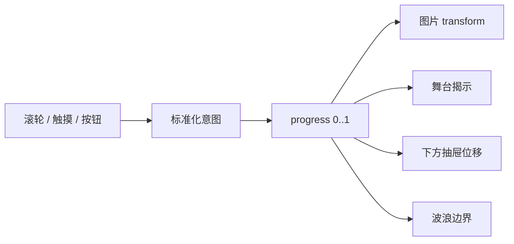

## 摘要

“给元素加过渡”只能产生动画，不能保证动画连续、可反向或与手指同步。本站主页壁纸需要同时处理鼠标滚轮、触控板、触摸、按钮与 Escape，并保持顶栏和左栏稳定。本文把实现拆成纯输入判定、单一进度、几何映射和渲染提交四层，说明一次从卡顿交叉淡入到连续抽屉动画的架构演进。

**关键词：** 手势状态机；连续进度；WAAPI；GPU 合成；减少动态

## 1. 原问题为何会“割裂”

早期思路曾把收起封面和展开大图视为两个画面：一个淡出，另一个淡入；下方内容只移动固定距离。即使每段动画本身流畅，用户仍会看到状态跳变，因为图片取景、波浪边界与内容位移没有共享同一时间轴。

真正的问题不是时长，而是状态模型。若只保存 `expanded: boolean`，拖动到 43% 时就没有准确状态；反向操作只能先跳到端点再播放。

## 2. 单一进度模型

本站将壁纸状态表示为 `progress ∈ [0, 1]`：0 表示收起，1 表示展开。运行状态再区分 `collapsed`、`dragging`、`settling`、`expanded`。所有可见变化都由同一进度派生：

[`homeCoverGesture.ts`](https://github.com/ice11123/blog_test2/blob/main/src/lib/homeCoverGesture.ts) 处理阈值、方向、速度和释放目标；[`homeCoverMotionGeometry.ts`](https://github.com/ice11123/blog_test2/blob/main/src/lib/homeCoverMotionGeometry.ts) 只计算几何。把纯逻辑与 DOM 分开后，边缘情况可以用 Node 测试复现，不必依赖手工拖动。

## 3. 不同设备如何映射为同一意图

“向上”在设备上的含义不完全相同。桌面收起状态只有页面已到顶部时才接管向上滚动；否则保留原生页面滚动。移动端则从顶栏下方下拉展开、在全图状态上推收回，收起时的上滑仍用于浏览文章。

输入层最终只输出标准化意图：正值展开，负值收回。横向手势、多点触摸与顶栏操作不进入壁纸状态机。这种接口隔离能避免设备判断散落在渲染代码中。

## 4. 连续取景与抽屉运动

壁纸不是在两张图之间交叉淡入，而是使用同一张已解码图片，从收起时的 `cover` 取景连续变换到展开时的完整取景。下方内容与三层波浪组成一个抽屉，位移由“展开舞台高度减去收起封面高度”计算，因此波浪始终是抽屉上沿，而不是漂浮的装饰层。

顶栏和左侧栏不参与位移。这个约束既保留导航稳定性，也缩小需要每帧更新的合成层范围。

## 5. 为什么使用 WAAPI 与 transform

拖动时需要直接设置时间线进度，释放后又要从当前位置结算到最近端点。Web Animations API（WAAPI）适合复用同一动画并控制 `currentTime`；主要视觉位移使用完整 `transform`，避免每帧修改 `top`、`height` 等触发布局的属性。

三层波浪保留为独立 HTML 容器和静态 SVG 形状，只移动外层容器。历史性能排查发现，直接动画 SVG 内部会产生更多 Layout/Paint；移到合成友好的外层后，记录中的布局事件消失、绘制次数显著下降。该数据是特定环境的回归证据，不是所有设备的绝对承诺。

## 6. 生命周期与性能纪律

动画层不能永久带着 `will-change`，否则浏览器会长期保留额外合成资源。本站只在交互期准备合成层，稳定后清理；页面离屏、切到后台、完全展开或用户选择降低动态时，波浪时间线暂停。

高清壁纸也不应阻塞首屏。首屏先使用适配尺寸与低清占位，用户首次表达展开意图时再准备更高分辨率资源，解码完成后只在稳定状态替换，避免动画中闪图。

## 7. 测试与复现

纯逻辑测试至少覆盖：页面未到顶时不接管、任意鼠标位置可展开、横向和多点取消、方向反转、任意进度释放、降低动态立即完成。真实浏览器则检查十次快速反向操作后没有残留 `inert`、滚动锁或动画对象。

性能分析不要只看平均帧率。更有价值的指标包括动画期 Long Task、p95 帧时间、最大帧和 Layout/Paint 事件。本站历史记录在 CPU×4 环境下曾测得 p95 约 5.7ms、Long Task 为 0，但设备、浏览器与页面内容变化后必须重新测量。

## 8. 局限与结论

复杂手势会增加状态边界，测试成本高于简单按钮；`clip-path` 和大面积滤镜也可能在部分 GPU 上退回昂贵绘制。因此实现选择始终受真实 trace 约束。流畅动画的本质不是“少动画”，而是让输入、状态、几何和渲染共享同一连续模型。

[上一篇：03｜页面布局、主题与响应式边界](/blog_test2/blog/ai-agent协作与开发/网站开发与维护/03-layout-theme-responsive/) · [下一篇：05｜数据请求与性能治理](/blog_test2/blog/ai-agent协作与开发/网站开发与维护/05-data-performance/)
