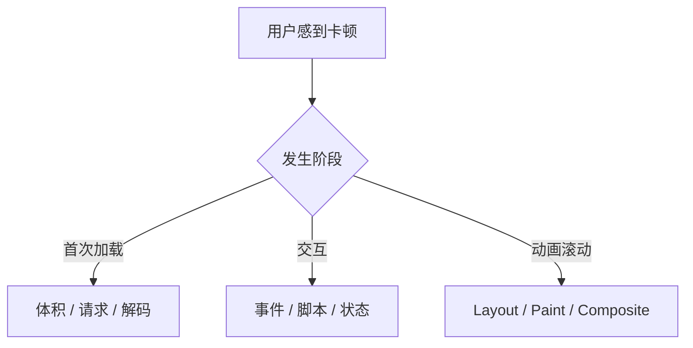

## 摘要

静态站点仍可能因外部请求、重复初始化和未清理监听器而卡顿。本站首页包含 GitHub Languages、Contributions 和系统状态等增强模块，它们不应与正文争夺首屏资源。本文研究请求并发、超时、重试、缓存、可见性触发与 Astro 客户端路由生命周期，给出从“少发请求”到“正确结束工作”的完整治理方法。

**关键词：** Web 性能；并发池；超时；缓存；ClientRouter

## 1. 性能问题的分层诊断

“网站卡”可能来自三条不同链路：网络等待、主线程计算、渲染绘制。GitHub Pages 主要提供静态文件，加载完成后的滚动和动画卡顿通常不能简单归因于托管上限；更应检查事件监听、布局抖动、图片解码和合成层。

只有先定位阶段，优化才不会变成删除视觉效果的“治标”。

## 2. 首屏请求为什么必须延后

首页正文和主图是首屏核心；语言统计、贡献网格和远程状态属于增强信息。本站用 IntersectionObserver 在模块接近视口时才启动请求；贡献网格甚至在用户首次展开对应区域后再创建。

这种延迟并非让所有内容变慢，而是建立优先级：先保证可阅读和可交互，再补充远程数据。头像等非首屏图片也可使用延迟加载，首屏壁纸则保持高优先级，不能机械地全部 `loading="lazy"`。

## 3. 并发、超时与重试

[`requestPool.ts`](https://github.com/ice11123/blog_test2/blob/main/src/lib/requestPool.ts) 将请求并发限制为 3，避免多个语言或状态请求同时占满浏览器连接和主线程回调。超时与有限重试由共享请求工具统一处理，而不是每个组件各写一套 `setTimeout`。

合理重试需要三个条件：错误具有暂时性、次数有上限、旧请求能被取消。对于明确的 4xx 或页面已经离开的请求，继续重试只会浪费资源。错误界面应显示降级状态，而不是让加载骨架永久旋转。

## 4. 会话缓存与进行中请求复用

[`timedCache.ts`](https://github.com/ice11123/blog_test2/blob/main/src/lib/timedCache.ts) 为公开数据提供有期限的会话缓存；同一次导航中的相同请求还能共享进行中的 Promise。两者解决不同问题：缓存避免已完成请求重复发送，Promise 复用避免同时出现的多个消费者制造竞态。

缓存必须包含失效策略。永久缓存会把一次失败变成长期错误；过短缓存则没有意义。远程状态展示还应标明其观测时间，避免用户把旧结果理解成实时事实。

## 5. 客户端路由下的清理

本站保留 Astro ClientRouter，因此“页面加载一次”不等于“脚本只运行一次”。每次页面切换都可能重新进入初始化逻辑。安全模式是：

1. 判断当前页面是否需要该模块；
2. 为 DOM 根节点记录初始化状态；
3. 保存监听器、观察器、计时器和 AbortController；
4. 在路由切换或节点失效时统一释放。

如果忽略第 4 步，用户访问几次首页后，一个滚动事件可能触发多轮计算。这类问题往往在刷新页面时消失，因此比普通语法错误更难发现。

## 6. 按需加载代码

搜索功能首次产生搜索意图时才动态导入 Fuse。KaTeX、文章和状态相关样式也尽量由对应布局或组件加载。代码拆分的目标不是产生越多小文件越好，而是避免与当前页面无关的解析和执行进入关键路径。

判断是否值得拆分可看三个问题：模块是否体积明显、是否只在少数页面使用、是否能在需要前提前加载。一个极小且所有页面都用的模块，强行动态导入反而增加网络调度。

## 7. 可重复的性能检查

1. 清空缓存，记录首屏请求数、传输体积和 LCP。
2. 页面内多次往返，确认每个可见模块每次导航最多一轮请求。
3. 在 DevTools Performance 中分别录制滚动、主题和壁纸操作。
4. 使用 CPU×4 检查 Long Task、p95 与最大帧，不只看肉眼感觉。
5. 切换后台、离开视口或展开壁纸，确认不需要的 rAF 与观察器停止。

性能回归测试只能守住已知结构，真实 trace 才能发现浏览器和设备差异。

## 8. 局限与结论

外部 API 的延迟和限流不受本站控制，缓存也不能把不可用服务变成可靠服务。正确策略是优先保证静态内容完整，再让远程模块可取消、可降级、可复用。性能工程不是砍掉效果，而是让每项工作在正确时间开始、只做一次，并在不再需要时停止。

[上一篇：04｜主页壁纸动效状态机](/blog_test2/blog/ai-agent协作与开发/网站开发与维护/04-motion-state-machine/) · [下一篇：06｜Markdown/MDX 渲染与发布流水线](/blog_test2/blog/ai-agent协作与开发/网站开发与维护/06-markdown-mdx-pipeline/)
