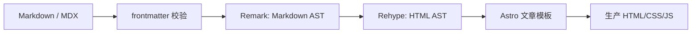

## 摘要

Markdown 看似只是文本，实际渲染要经过元数据校验、抽象语法树转换、标题锚点、数学公式、代码高亮与模板装配。任意一层改变都可能影响目录、深链接或样式。本文以本站真实插件链为线索，解释内容从源文件到生产 HTML 的各个阶段，并讨论如何在保留原始笔记语义的同时提供稳定阅读体验。

**关键词：** Markdown；MDX；AST；Remark；Rehype；内容发布

## 1. 为什么要研究渲染管线

当公式颜色错误、标题目录跳转失败或图片没有进入文章时，直接修改最终 CSS 往往只处理表象。需要先回答：问题发生在源 Markdown、Markdown AST、HTML AST、Astro 模板，还是浏览器样式？

## 2. 源文件与 frontmatter

文章正文保留在 `.md` 或 `.mdx` 文件中。Markdown 适合标准排版，MDX 允许插入经过项目注册的交互组件。两者都先通过内容集合 schema，确保标题、日期和分类等元数据可被其他页面可靠消费。

对于从 PDF、Obsidian 或手写笔记转换的内容，应优先保留原 Markdown 的标题、强调、颜色标记和图片关系，而不是为了“统一风格”随意改写。转换任务的验收对象不是只有文字，还包括链接、公式、图像与语义层级。

## 3. Remark：理解 Markdown 语义

[`astro.config.mjs`](https://github.com/ice11123/blog_test2/blob/main/astro.config.mjs) 配置的 Remark 插件在 Markdown AST 阶段工作。当前能力包括：

- GFM 表格、任务列表等扩展；
- 定义列表、emoji、上下标与高亮；
- 数学语法识别；
- GitHub 风格提示块；
- Mermaid 代码块转为图表组件所需结构。

顺序很重要：一个插件产生的节点可能正是下一个插件的输入。新增语法时要先定义源格式和失败表现，再决定使用 Remark、Rehype 还是 Astro 组件，不能把所有转换都塞进字符串替换。

## 4. Rehype：形成 HTML 结构

Rehype 阶段处理 HTML AST。本站使用 KaTeX 渲染数学公式，用 slug 插件为标题生成稳定 ID，再为标题添加自链接。先生成 ID、后添加链接这一顺序保证三者一致：正文标题、自链接和右侧目录都指向同一锚点。

客户端 TOC 不应重新计算标题 ID。中文、重复标题和标点会让自制 slug 规则与构建规则产生细微差异，最终表现为目录高亮正常但点击后找不到目标。

## 5. 代码、公式与图表的边界

代码高亮由 Expressive Code 在构建阶段完成；KaTeX 也尽可能输出静态结构。Mermaid 和 Plot3D 等交互内容需要浏览器能力，因此必须有加载中、失败和超时状态。

宽内容的原则是“局部容器承担溢出”：代码块、表格、公式和图表可以在自身范围横向滚动，整篇页面不能被撑宽。对于本来能够换行或缩放的公式，不应无条件产生上下或双重滚动条；是否滚动应由内容实际宽度决定。

## 6. 图片资源如何进入文章

仓库内图片可由相对路径或 Astro 资源管线引用，具体选择取决于内容格式。关键是保持图片与 Markdown 的可迁移关系，并在构建后检查真实资源 URL。图片应包含有意义的替代文本；用于原始资料核对的整页扫描，不应默认以超大图片插入正文，而应按需要裁图、嵌入或提供源文件链接。

生产构建是验证图片最可靠的阶段，因为开发服务器可能容忍路径大小写或缓存差异，而部署环境不会。

## 7. 新手发布检查表

1. frontmatter 通过 schema，分类名与常量一致。
2. 标题从 `h2` 开始形成清晰层级，不用加粗文本伪装标题。
3. 站内链接包含部署基础路径或由 URL 工具生成。
4. 公式、图片、代码与 Mermaid 在亮暗主题下均可读。
5. 右侧目录能定位重复和中文标题。
6. 执行检查、测试与生产构建，再打开构建后的真实页面。

## 8. 局限与结论

插件越多，语法交互和升级风险越高。因此本站应优先使用标准 Markdown，只有明确需求才增加扩展。理解 AST 管线后，维护者可以把问题定位到正确层级，而不是用全局 CSS 或运行时脚本掩盖源结构错误。

[上一篇：05｜数据请求与性能治理](/blog_test2/blog/ai-agent协作与开发/网站开发与维护/05-data-performance/) · [下一篇：07｜管理草稿、发布脚本与写入边界](/blog_test2/blog/ai-agent协作与开发/网站开发与维护/07-admin-publishing/)
