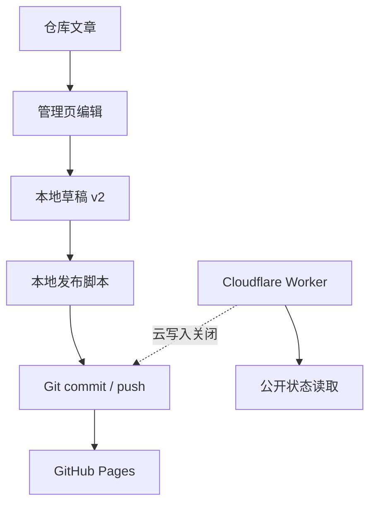

## 摘要

内容后台最危险的错误不是按钮失效，而是界面暗示“已经发布”，实际只保存到本机；或发布脚本把无关改动一并提交。本站将浏览器草稿、本地 Git 发布、公开状态服务和未来云写入拆成四层。本文依据当前配置说明每层真实能力、失败边界与恢复方法，并特别澄清：`PUBLIC_CLOUD_PUBLISH_ENABLED=false`，线上云端文章写入当前未启用。

**关键词：** localStorage；Git；发布安全；Cloudflare Worker；能力边界

## 1. 四类状态不能混为一谈

仓库内容是版本事实；本地草稿是浏览器中的未发布状态；Git 提交和推送才会触发 Pages 部署；Worker 当前用于健康和公开状态，不代表管理页可以远程写仓库。

## 2. 草稿 v2 为什么只保存差异

[`adminDrafts.ts`](https://github.com/ice11123/blog_test2/blob/main/src/lib/adminDrafts.ts) 使用 `blog-test2-admin-drafts-v2`。它只保存真正修改过的仓库文章和本地新建草稿，而不是把整份仓库快照复制到 localStorage。

差异存储有三个好处：仓库文章更新后，未编辑条目能立即看到新版本；存储体积随实际编辑量增长；“放弃本地修改”可以明确恢复仓库事实。首次读取旧 v1 时，迁移逻辑只保留本地新文章、带编辑时间的修改和待发布记录，成功后清理旧键。

localStorage 写入也可能因配额或隐私策略失败，因此保存函数会回读验证，而不是把 `setItem()` 未抛错等同于数据可靠落盘。

## 3. 云发布关闭时的界面语义

当前 `PUBLIC_CLOUD_PUBLISH_ENABLED=false`。在这种状态下：

- 本地新草稿可以删除；
- 仓库文章有本地改动时，可以“放弃本地修改”；
- 没有本地修改的正式文章不能被管理页伪装成可删除；
- 发布操作应明确引导到本地脚本或说明服务未启用。

按钮文案是系统契约的一部分。若把“放弃修改”写成“删除文章”，即使底层没有删仓库，也会造成错误心理模型。

## 4. 本地发布脚本的护栏

[`scripts/publish-article.mjs`](https://github.com/ice11123/blog_test2/blob/main/scripts/publish-article.mjs) 将发布过程收敛为可检查步骤：

1. 执行前暂存区必须为空，防止夹带其他文件；
2. 默认拒绝覆盖同名文章，只有显式 `--overwrite` 才允许；
3. 提交只限定目标文章路径；
4. 默认推送前确认当前分支是 `main`、远端是 `origin`；
5. 提交前失败可回滚目标文件；推送失败可用恢复参数继续。

这不是替代 Git，而是把高风险的重复操作变成确定流程。脚本仍不能替用户判断文章内容是否正确，因此发布前的 diff 审查不可省略。

## 5. Worker 的当前与未来职责

Worker 配置的目标仓库固定为 `ice11123/blog_test2`，写接口还会再次校验 Owner/Repo。代码保留 OAuth、CSRF、加密令牌和原子 Git Tree 提交等未来路径，但由于云发布开关关闭且 OAuth 未配置，它们不是当前线上工作流。

已接入的是健康检查和公开状态读取，并带有约 90 秒 KV 陈旧缓存。公开状态允许降级，不能成为首页主体的单点依赖。

## 6. 故障恢复思路

- 草稿异常：先导出可见内容，再检查 v2 键和迁移结果；不要直接清空整个站点存储。
- 发布脚本拒绝：阅读其暂存区、分支或覆盖提示，先解决原因，不绕过护栏。
- push 失败：确认提交已经产生后使用恢复流程，避免重复生成文章。
- Pages 未更新：区分“本地已提交”“远端已推送”“Actions 已成功”“浏览器缓存已刷新”四个阶段。

## 7. 局限与结论

本地草稿不具备跨设备同步和多人冲突解决能力；未启用的云写入也不能被当作备份。本站当前最可靠的发布事实仍是 Git 历史与 Pages 工作流。清晰区分能力层次，比提供一个看似万能的“发布”按钮更重要。

[上一篇：06｜Markdown/MDX 渲染与发布流水线](/blog_test2/blog/ai-agent协作与开发/网站开发与维护/06-markdown-mdx-pipeline/) · [下一篇：08｜测试、CI 与 GitHub Pages 部署](/blog_test2/blog/ai-agent协作与开发/网站开发与维护/08-testing-ci-deployment/)
