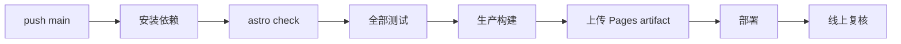

## 摘要

“本地能打开”不能证明网站可以安全部署。本站把纯逻辑测试、视觉结构契约、Astro 类型检查、生产构建和 GitHub Pages 工作流组成分层门禁。本文说明各层能发现什么、不能发现什么，并给出从修改到线上复核的完整证据链。

**关键词：** 自动化测试；持续集成；GitHub Actions；部署；回归

## 1. 质量门禁的研究对象

不同故障需要不同工具：

| 层级 | 主要发现 | 不能替代 |
| --- | --- | --- |
| Node 单元测试 | 排序、缓存、手势、草稿等纯逻辑 | 真实布局与浏览器兼容 |
| 结构契约测试 | 禁止危险 CSS、确认内容与配置约束 | 肉眼观感 |
| `astro check` | 类型、组件与模板问题 | 生产资源完整性 |
| `astro build` | 路由、内容、图片与产物生成 | 线上网络和缓存 |
| 浏览器验收 | 响应式、交互、视觉、性能 | 长期自动回归 |

测试不是越多越好，而是每个已知风险都有成本合适的守门方式。

## 2. 根项目与 Worker 分开测试

根目录 `pnpm test` 依次运行 `test:root` 与 `test:worker`。根项目使用 Node 内置测试，不为简单纯逻辑额外引入测试运行时；Worker 在自己的目录中验证请求、缓存和仓库目标边界。

这种分层让失败范围清晰：文章契约错误不会混成 Worker 网络错误，Worker 配置变化也不会要求浏览器启动。

## 3. 为什么需要契约测试

某些回归不是函数返回值错误，而是团队曾经明确禁止的结构重新出现。例如：`transition: all`、高频布局属性动画、缺失降低动态分支、主题下拉菜单复活，或关键文章分类写错。

契约测试直接扫描受控文件和标记，优点是快速、稳定；局限是只能保护已知模式。维护者应把一次昂贵故障提炼成最小契约，而不是把整个源码快照锁死。

## 4. CI 部署顺序

[`deploy.yml`](https://github.com/ice11123/blog_test2/blob/main/.github/workflows/deploy.yml) 在上传 Pages 产物前执行检查、全部测试与构建。只有前序成功，静态产物才进入 GitHub Pages 部署步骤。

顺序的价值在于失败尽量靠前。类型问题无需等完整构建，测试失败更不应产生待部署产物。

## 5. 一次可核验的发布

1. 用 `git diff` 确认改动范围，不夹带无关文件。
2. 执行 `pnpm test`、`pnpm run check`、`pnpm run build` 与 `git diff --check`。
3. 提交到预期分支并推送 `origin/main`。
4. 等待对应提交的 Pages 工作流成功，而不是只看卡片上的时间。
5. 打开线上地址，用桌面和移动视口验证关键路径。
6. 记录提交哈希、截图或性能 trace，让验收证据能对应到具体版本。

“已经 push”与“已经部署”是不同状态；“工作流成功”与“用户缓存已更新”也不是同一件事。

## 6. 失败如何定位

- check 失败：先处理类型和模板位置，不应通过关闭规则掩盖。
- test 失败：判断是行为回归还是测试假设已过期，并用最小输入复现。
- build 失败：关注内容 schema、资源路径、动态路由与 postbuild 校验。
- Actions 失败：对照具体 job 与提交哈希，避免修错分支。
- 线上异常：检查部署产物、基础路径、浏览器缓存和外部服务降级。

## 7. 局限与结论

CI 运行环境无法覆盖所有 GPU、触摸设备和浏览器版本，截图也不能证明交互完整。本站仍需要真实设备和性能录制。但分层门禁能把大量确定性错误挡在部署前，并让每次发布具有可追踪的证据链。

[上一篇：07｜管理草稿、发布脚本与写入边界](/blog_test2/blog/ai-agent协作与开发/网站开发与维护/07-admin-publishing/) · [下一篇：09｜证据驱动的核心维护方法](/blog_test2/blog/ai-agent协作与开发/网站开发与维护/09-evidence-driven-maintenance/)
