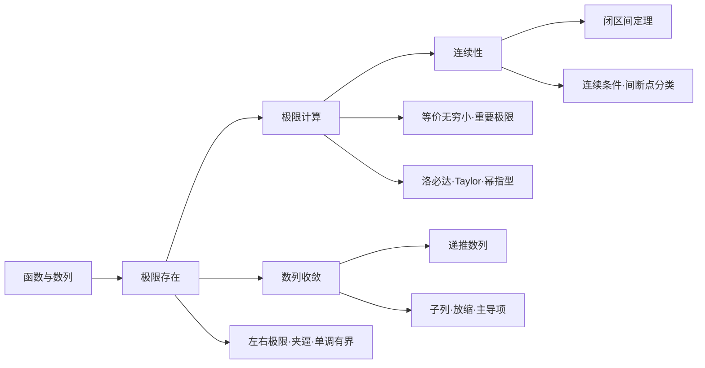

<a href="/blog_test2/blog/%E5%AD%A6%E4%B9%A0%E7%AC%94%E8%AE%B0/00-calculus-index/">返回总索引</a>　·　<a href="/blog_test2/blog/%E5%AD%A6%E4%B9%A0%E7%AC%94%E8%AE%B0/01-limits-and-sequences/">查看完整笔记</a>

> **蓝笔补充｜复习目标**
> 掌握极限与连续的判定逻辑，熟练选择极限计算方法，能证明递推数列收敛并计算其极限。本文只保留数一所需主干；详细推导回到原笔记查看。

## 一、知识结构

### 数一复习优先级

| 层级 | 内容 |
|---|---|
| 核心 | 极限计算、左右极限、连续与间断点、递推数列、夹逼与单调有界 |
| 必须理解 | 极限定义与性质、无穷小阶数、子列、闭区间连续函数性质 |
| 辅助工具 | Stolz 定理、压缩估计、黎曼和识别 |

---

# 第一章　函数、极限与连续

## 1.1 函数基础

| 内容 | 必须掌握的结论 |
|---|---|
| 定义域 | 分母不为零；偶次根被开方数非负；对数真数为正；反三角函数满足取值限制 |
| 复合函数 | $x\in D_g$ 且 $g(x)\in D_f$ |
| 奇偶性 | $f(-x)=f(x)$ 为偶函数；$f(-x)=-f(x)$ 为奇函数 |
| 分段函数 | 分界点必须分别检查左右极限、函数值和左右导数 |

> **重点订正｜第一检查项**
> 极限、连续、求导之前先写定义域。函数在某点无定义，不代表该点极限一定不存在。

## 1.2 极限与连续的核心逻辑

### 函数极限

$$
\lim_{x\to x_0}f(x)=A
\iff
\forall\varepsilon>0,\ \exists\delta>0,
\quad 0<|x-x_0|<\delta\Rightarrow|f(x)-A|<\varepsilon.
$$

极限只研究 $x_0$ 附近，不直接使用 $f(x_0)$。

### 左右极限

$$
\lim_{x\to x_0}f(x)=A
\iff
\lim_{x\to x_0^-}f(x)
=\lim_{x\to x_0^+}f(x)=A.
$$

遇到分段函数、绝对值、符号函数，优先计算左右极限。

### 连续

$$
f\text{ 在 }x_0\text{ 连续}
\iff
\lim_{x\to x_0}f(x)=f(x_0).
$$

连续必须同时满足：

1. $f(x_0)$ 有定义；
2. 双侧极限存在；
3. 极限等于函数值。

<a href="/blog_test2/blog/%E5%AD%A6%E4%B9%A0%E7%AC%94%E8%AE%B0/01-limits-and-sequences/#%E4%B8%80%E6%9E%81%E9%99%90%E7%9A%84%E5%AE%9A%E4%B9%89%E5%8F%8A%E6%80%A7%E8%B4%A8">查看原笔记：极限定义与性质</a>

## 1.3 极限性质与存在准则

| 结论 | 使用条件或含义 |
|---|---|
| 唯一性 | 极限存在时其值唯一 |
| 局部有界 | 有限极限存在 $\Rightarrow$ 函数在去心邻域有界 |
| 局部保号 | 极限 $A>0$，则充分靠近时函数为正 |
| 四则运算 | 商的分母极限必须非零 |
| 夹逼准则 | $g\le f\le h$ 且 $g,h\to A$，则 $f\to A$ |
| 单调有界 | 单调递增有上界或单调递减有下界，则相应极限存在 |

> **重点订正｜不能倒推**
> 局部有界不能推出极限存在；函数在去心邻域为正且极限存在，只能推出极限非负。

## 1.4 无穷小与等价替换

设 $\alpha,\beta\to0$：

$$
\frac{\beta}{\alpha}\to0\Rightarrow\beta=o(\alpha),
\qquad
\frac{\beta}{\alpha}\to1\Rightarrow\beta\sim\alpha.
$$

### 常用等价无穷小（$x\to0$）

$$
\sin x\sim\tan x\sim\arcsin x\sim\arctan x\sim x,
$$

$$
e^x-1\sim\ln(1+x)\sim x,
$$

$$
(1+x)^\alpha-1\sim\alpha x,
\qquad
1-\cos x\sim\frac{x^2}{2},
$$

$$
x-\sin x\sim\frac{x^3}{6},
\qquad
\tan x-x\sim\frac{x^3}{3},
$$

$$
x-\arctan x\sim\frac{x^3}{3},
\qquad
\tan x-\sin x\sim\frac{x^3}{2}.
$$

> **重点订正｜替换边界**
> 等价无穷小适合乘积、商式。加减式可能发生主项抵消，必须展开到第一个不抵消项。

## 1.5 极限计算

### 方法选择

| 原式结构 | 优先方法 | 关键检查 |
|---|---|---|
| 可直接代入 | 连续性与四则运算 | 点是否在定义域内 |
| $0/0$ | 因式分解、等价无穷小 | 抵消后是否仍为未定式 |
| $\infty/\infty$ | 提取主导项、洛必达 | 分母是否确实趋于无穷 |
| $0\cdot\infty$ | 改写成商 | 变形后的类型 |
| $\infty-\infty$ | 通分、有理化、Taylor | 首个不抵消项 |
| $1^\infty,0^0,\infty^0$ | 取对数 | 底数在实数范围内为正 |
| 分段或绝对值 | 左右极限 | 两侧结果是否相等 |
| 含参数 | Taylor 或主项比较 | 令低阶项按题意抵消 |

### 两个重要极限

$$
\lim_{x\to0}\frac{\sin x}{x}=1,
$$

$$
\lim_{x\to0}(1+x)^{1/x}=e,
\qquad
\lim_{n\to\infty}\left(1+\frac1n\right)^n=e.
$$

若 $u\to0$、$v\to\infty$ 且 $uv\to A$，则在底数为正时

$$
(1+u)^v\to e^A.
$$

### 洛必达法则

只直接处理 $0/0$ 或 $\infty/\infty$ 型。使用前检查：去心邻域可导、分母导数不为零、导数比极限存在或为无穷。

$$
\lim\frac{f(x)}{g(x)}
=\lim\frac{f'(x)}{g'(x)}.
$$

导数比没有极限，不能反推原极限不存在。

### Taylor 主项

$$
e^x=1+x+\frac{x^2}{2}+\frac{x^3}{6}+o(x^3),
$$

$$
\ln(1+x)=x-\frac{x^2}{2}+\frac{x^3}{3}+o(x^3),
$$

$$
\sin x=x-\frac{x^3}{6}+\frac{x^5}{120}+o(x^5),
$$

$$
\cos x=1-\frac{x^2}{2}+\frac{x^4}{24}+o(x^4),
$$

$$
\tan x=x+\frac{x^3}{3}+\frac{2x^5}{15}+o(x^5),
$$

$$
(1+x)^\alpha
=1+\alpha x+\frac{\alpha(\alpha-1)}{2}x^2+o(x^2).
$$

展开到相减后第一个不抵消的非零项即可。

### 幂指型

$$
u(x)^{v(x)}=e^{v(x)\ln u(x)}.
$$

先求 $v\ln u$ 的极限，再作指数还原。不能在指数中不加检查地使用等价替换。

<a href="/blog_test2/blog/%E5%AD%A6%E4%B9%A0%E7%AC%94%E8%AE%B0/01-limits-and-sequences/#%E4%BA%8C%E6%9E%81%E9%99%90%E8%AE%A1%E7%AE%97%E4%B8%8E%E6%96%B9%E6%B3%95">查看原笔记：极限计算方法</a>

## 1.6 间断点与连续函数性质

### 间断点分类

| 类型 | 左右极限 |
|---|---|
| 可去间断点 | 左右极限有限且相等，但函数值缺失或不相等 |
| 跳跃间断点 | 左右极限有限但不相等 |
| 无穷间断点 | 至少一个单侧极限为无穷 |
| 振荡间断点 | 至少一个单侧极限因振荡不存在 |

前两类是第一类间断点；后两类是第二类间断点。

### 闭区间上连续函数

若 $f$ 在 $[a,b]$ 连续，则：

- $f$ 有界；
- $f$ 能取得最大值和最小值；
- $f$ 具有介值性；
- 若 $f(a)f(b)<0$，则至少存在 $\xi\in(a,b)$ 使 $f(\xi)=0$。

零点定理只保证存在性；证明唯一性还需单调性或其他条件。

## 1.7 第一章题型入口

| 题型 | 解题主线 |
|---|---|
| 求极限 | 代入判型 → 变形 → 选等价、洛必达或 Taylor |
| 含参极限 | 展开 → 找最低阶项 → 令系数满足题意 |
| 分段函数连续 | 左极限 = 右极限 = 函数值 |
| 间断点分类 | 找候选点 → 算左右极限 → 分类 |
| 零点存在 | 构造连续函数 → 找端点异号区间 |

---

# 第二章　数列极限

## 2.1 定义与基本性质

$$
\lim_{n\to\infty}x_n=A
\iff
\forall\varepsilon>0,\ \exists N,
\quad n>N\Rightarrow|x_n-A|<\varepsilon.
$$

| 性质 | 结论 |
|---|---|
| 唯一性 | 收敛数列只有一个极限 |
| 有界性 | 收敛 $\Rightarrow$ 有界；反向不成立 |
| 子列 | 原数列收敛，则所有子列趋于同一极限 |
| 发散判定 | 找到两个极限不同的子列即可证明发散 |
| 保号与四则运算 | 与函数极限相应性质一致 |

<a href="/blog_test2/blog/%E5%AD%A6%E4%B9%A0%E7%AC%94%E8%AE%B0/01-limits-and-sequences/#%E4%B8%80%E6%95%B0%E5%88%97%E5%8F%8A%E5%85%B6%E6%9E%81%E9%99%90">查看原笔记：数列及其极限</a>

## 2.2 数列极限方法

| 结构 | 方法 |
|---|---|
| 有理式、多项式 | 提取最高次幂 |
| 对数、幂、指数、阶乘混合 | 比较增长速度 |
| 振荡因子 | 夹逼或构造不同子列 |
| $n$ 次根 | 取对数或最大项夹逼 |
| 和式 | 裂项、夹逼、Stolz、黎曼和 |
| 乘积 | 取对数化为和式 |
| 递推数列 | 单调有界或压缩估计 |

增长速度：

$$
(\ln n)^\alpha\ll n^\beta\ll a^n\ll n!\ll n^n
\qquad(a>1,\ \alpha,\beta>0).
$$

## 2.3 递推数列

对

$$
x_{n+1}=f(x_n),
$$

标准顺序是：先证明收敛，再由连续性得到

$$
A=f(A).
$$

直接解不动点方程只能得到候选极限，不能证明数列收敛。

若存在 $0<q<1$ 使

$$
|x_{n+1}-A|\le q|x_n-A|,
$$

则 $x_n\to A$。

## 2.4 和式、乘积与根式

### 和式夹逼

若 $m_n\le u_k\le M_n$，则

$$
n m_n\le\sum_{k=1}^{n}u_k\le n M_n.
$$

### 黎曼和接口

$$
\frac1n\sum_{k=1}^{n}f\left(\frac{k}{n}\right)
\longrightarrow
\int_0^1f(x)\,dx.
$$

这是与定积分章节的接口；尚未使用积分时可先尝试夹逼。

### 乘积取对数

$$
P_n=\prod_{k=1}^{n}u_k
\quad\Rightarrow\quad
\ln P_n=\sum_{k=1}^{n}\ln u_k.
$$

### $n$ 次根

$$
\sqrt[n]{a_n}=e^{\ln a_n/n}.
$$

## 2.5 Stolz 定理（辅助）

当 $y_n$ 严格递增且 $y_n\to+infty$，在其余条件满足时：

$$
\lim\frac{x_{n+1}-x_n}{y_{n+1}-y_n}=L
\Rightarrow
\lim\frac{x_n}{y_n}=L.
$$

适合数列比值、累加和与幂次比较。必须检查分母数列条件，且不能反向使用。

<a href="/blog_test2/blog/%E5%AD%A6%E4%B9%A0%E7%AC%94%E8%AE%B0/01-limits-and-sequences/#%E4%BA%8C%E6%95%B0%E5%88%97%E6%9E%81%E9%99%90%E7%9A%84%E6%B3%95%E5%88%99%E4%B8%8E%E8%AE%A1%E7%AE%97">查看原笔记：数列极限计算</a>

## 2.6 第二章题型入口

| 题型 | 解题主线 |
|---|---|
| 显式通项 | 比较增长速度，提取主导项 |
| 振荡数列 | 看振幅是否趋零；否则比较子列 |
| 递推数列 | 有界 + 单调 → 收敛 → 解不动点 |
| 和式极限 | 裂项、夹逼、Stolz 或黎曼和 |
| 乘积极限 | 取对数转成和式 |

---

# 三、考前一页速查

## 必须会写的关系

$$
\text{连续}\Rightarrow\text{极限存在},
\qquad
\text{可导}\Rightarrow\text{连续},
$$

$$
\text{单调}+\text{有界}\Rightarrow\text{收敛},
$$

$$
x_n\to A\Rightarrow\text{任意子列均趋于 }A.
$$

## 必须避免的错误

1. 不检查定义域便直接代入；
2. 把函数值与极限混为一谈；
3. 只算一侧便判断双侧极限；
4. 在加减式中直接替换等价无穷小；
5. 未判型便使用洛必达法则；
6. 幂指型不取对数，或忽略底数为正；
7. 左右极限相等便直接判断连续；
8. 用零点定理证明唯一根；
9. 递推数列先解 $A=f(A)$，却没有证明收敛；
10. 把有界误当成收敛，或反向使用 Stolz 定理。

## 原笔记入口

- <a href="/blog_test2/blog/%E5%AD%A6%E4%B9%A0%E7%AC%94%E8%AE%B0/01-limits-and-sequences/#%E7%AC%AC%E4%B8%80%E7%AB%A0-%E5%87%BD%E6%95%B0%E6%9E%81%E9%99%90%E4%B8%8E%E8%BF%9E%E7%BB%AD">第一章完整笔记</a>
- <a href="/blog_test2/blog/%E5%AD%A6%E4%B9%A0%E7%AC%94%E8%AE%B0/01-limits-and-sequences/#%E7%AC%AC%E4%BA%8C%E7%AB%A0-%E6%95%B0%E5%88%97%E6%9E%81%E9%99%90">第二章完整笔记</a>
- <a href="/blog_test2/blog/%E5%AD%A6%E4%B9%A0%E7%AC%94%E8%AE%B0/01-limits-and-sequences/#%E6%9E%81%E9%99%90%E8%AE%A1%E7%AE%97%E6%96%B9%E6%B3%95%E9%80%89%E6%8B%A9%E8%A1%A8">原笔记方法选择表</a>
- <a href="/blog_test2/blog/%E5%AD%A6%E4%B9%A0%E7%AC%94%E8%AE%B0/01-limits-and-sequences/#%E6%A0%B8%E5%BF%83%E6%98%93%E9%94%99%E7%82%B9">原笔记易错点</a>

<a href="/blog_test2/blog/%E5%AD%A6%E4%B9%A0%E7%AC%94%E8%AE%B0/00-calculus-index/">返回总索引</a>　·　<a href="#%E9%AB%98%E6%95%B0%E7%AC%AC-12-%E7%AB%A0%E6%95%B0%E5%AD%A6%E4%B8%80%E5%A4%8D%E4%B9%A0%E6%8F%90%E7%BA%B2">返回顶部</a>
