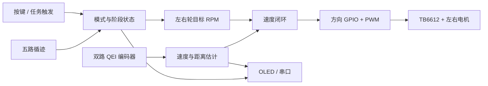

这不是一组按文件名排列的代码注释，而是一套面向新成员的工程专题。我们先从整车任务和信息流建立共同认知，再拆解工具链、硬件、软件、执行、反馈、控制和调试，最后回到整车联调与交付。

| 文档属性 | 内容 |
| --- | --- |
| 文档编号 | TI-CAR-01 |
| 文档类型 | 系列总览 / 系统上下文 |
| 目标读者 | 已完成 GPIO、PWM 基础学习的新成员 |
| 主控口径 | 全系列统一称为 `MSPM0G35XX` |
| 证据基线 | 当前工作副本 `TI_CAR_test1_6.7` |

> [!IMPORTANT]
> 工程中存在早期说明和打包快照。本文以当前构建配置、`empty.syscfg` 和实际进入主流程的代码为准。源码存在只代表“有实现”，初始化、任务登记和运行开关同时成立，才代表“当前启用”。

## 1. 这辆车要完成什么

当前工程控制一辆双轮差速小车。MSPM0G35XX 读取左右编码器和五路有效循迹信号，经过目标规划、状态管理与闭环控制，向 TB6612 输出两路方向信号和 PWM，同时通过 OLED、串口、LED 与蜂鸣器提供运行反馈。

系统的核心不是“让电机转”，而是让信息形成闭环：传感器说明车在哪里、跑得多快；软件决定下一步目标；驱动器执行命令；新的反馈再校正下一次输出。



## 2. 当前能力边界

| 能力 | 当前状态 | 依据 |
| --- | --- | --- |
| 双电机正反转与 PWM | 已接入主流程 | `Motor_Start()`、`Motor_SetDuty()` |
| 双编码器测速与累计距离 | 已接入主流程 | TIMG8/TIMG9 QEI、`Task_Encoder()` |
| 双轮速度闭环 | 已接入主流程 | `SpeedPID_Update()`、`Task_PID()` |
| 相对定距 | 已接入主流程 | `PositionControl_StartRelative*()` |
| 五路循迹 | 已接入主流程 | `Tracker_UpdateRange(4, 8)` |
| 20 秒 / 30 秒任务配置 | 已接入主流程 | `TrackMode_Start20s()`、`TrackMode_Start30s()` |
| OLED 与串口观测 | 条件启用 / 已启用 | OLED 初始化成功后登记；串口任务已登记 |
| IMU 姿态融合 | 代码保留，当前关闭 | `ICM42688_ENABLE` 为 `0U` |
| 舵机、蓝牙、串口屏 | 外设有配置，业务链待确认 | SysConfig 与当前调用关系 |

这里的“已接入”不是“已在所有实物和环境下验证”。上板结论还必须包含硬件版本、供电方式、固件提交、测试步骤和观测结果。

## 3. 系统怎样启动

入口只有三步：SysConfig 生成代码完成外设初始化，应用层建立任务与安全初态，主循环反复调用合作式调度器。

```c
int main(void)
{
    SYSCFG_DL_init();
    Task_Init();

    while (1) {
        Task_Start(Sys_GetTick);
    }
}
```

它不是 RTOS。所有任务共享同一个执行线程，任何阻塞式操作都会推迟编码器采样和控制计算。这个约束贯穿后续设计、调试和代码评审。

## 4. 先建立四条工程基线

### 4.1 安全基线

测试前要能立即断开电机电源；首次输出时车轮离地；先确认 PWM 为零和 `STBY` 状态，再逐步增加指令。编码器与传感器由 5 V 侧供电时，还要先确认进入 MCU 的信号电平不超过允许范围。

### 4.2 配置基线

记录 CCS 工程、SDK、SysConfig、编译器和当前工作副本。不要把另一个工程生成的 `ti_msp_dl_config.*` 或二进制文件直接搬过来使用。

### 4.3 数据基线

统一单位：速度用 RPM，距离在底层标定中用 cm/count，任务目标可用 cm 或 mm，但跨接口时必须显式换算。PWM 命令范围为 `-1000` 到 `1000`，不是百分数。

### 4.4 证据基线

| 等级 | 能回答的问题 |
| --- | --- |
| 文件存在 | 工程里有没有这份实现 |
| 配置生效 | 引脚、外设和构建目标是否被配置 |
| 调用生效 | 初始化和周期任务是否真正调用 |
| 上板验证 | 指定版本在指定实物上是否达到结果 |

企业化文档的价值，是让结论能够追溯到证据，而不是让描述听起来更肯定。

## 5. 专题路线

1. **总览**：理解目标、边界和整车信息流。
2. **工具链**：建立可重复构建、下载和首轮观察基线。
3. **硬件平台**：识别电源域、接口、复用和上电风险。
4. **软件架构**：理解 APP/BSP 分层、任务周期和安全收口。
5. **电机执行链**：从带符号命令走到 TB6612 与车轮。
6. **编码器与运动量**：从 QEI 计数得到 RPM 和距离。
7. **速度与位置控制**：理解目标规划、速度内环和位置外环。
8. **循迹系统**：理解五路输入、偏差、PD 和阶段状态机。
9. **可观测性**：用按键、OLED、串口和蜂鸣器缩短定位时间。
10. **整车联调与交付**：按层验证、管理故障、固化版本和证据。

学习顺序同样是调试顺序。系统出现问题时，先回退到最近一个已验证层，而不是同时修改控制参数、接线和任务状态。

## 6. 阅读约定

后续文章中的参数若来自源码，会标明配置位置；来自工程注释的标定值，会明确写成“工程记录值”；需要示波器、万用表或实车确认的内容，会保留为验证项，不把推测写成事实。

全系列只使用 `MSPM0G35XX` 作为主控名称。这样既覆盖当前作品的技术路线，也避免把教学重点绑定到具体料号差异；具体工程能否直接迁移到另一颗器件，仍需单独核对资源与构建配置。

## 本篇总结

- TI 小车是由输入、状态、目标、反馈、控制、执行和观测组成的闭环系统，不应被理解成若干独立驱动文件。
- 当前主流程已包含双电机、硬件 QEI、速度闭环、定距和五路循迹；IMU、舵机及部分通信接口不能因代码存在就视为已启用。
- 专题采用“整体—部分—整体”路线，拆解顺序同时也是故障隔离顺序。
- 所有结论都要区分文件、配置、调用和上板验证四个证据等级。

**下一篇：**[02｜工具链与工程启动](../02-system-architecture/)
