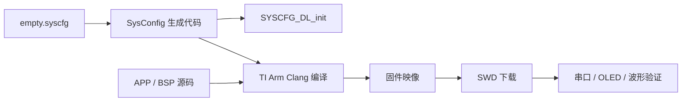

第一次接手嵌入式工程，最重要的产物不是“成功编译一次”，而是一套别人能够复现的环境、构建、下载与验证基线。本篇把工程启动过程整理成可交接的标准流程。

| 文档属性 | 内容 |
| --- | --- |
| 文档编号 | TI-CAR-02 |
| 上游输入 | `TI_CAR_test1_6.7` 当前工作副本 |
| 主要产出 | 可重复构建记录、下载记录、首轮运行证据 |
| 不覆盖 | 控制参数调优和整车性能验收 |

## 1. 先锁定当前工程

工程目录中可能同时出现当前工作副本、历史打包副本、旧说明和生成目录。打开 CCS 前，先记录要使用的项目根目录，并确认其中至少包含：

- `.project` 与 `.cproject`；
- `empty.syscfg`；
- `main.c`；
- `APP`、`BSP` 与当前生成配置；
- 活动的目标配置和链接配置。

本专题以 `TI_CAR_test1_6.7` 当前工作副本为证据源。`Debug` 目录属于构建产物，不用于判断源代码版本。

## 2. 工具链指纹

当前 `.cproject` 记录了以下依赖：

| 组件 | 工程记录版本 | 作用 |
| --- | --- | --- |
| TI Arm Clang | 4.0.3 LTS | 编译与链接 C 工程 |
| MSPM0 SDK | 2.4.0.06 | DriverLib、启动文件与设备支持 |
| SysConfig | 1.21.1 | 生成时钟、GPIO、定时器和通信外设配置 |

这些版本是“当前工程记录”，不是对所有环境的唯一要求。升级版本前要保存一次可构建基线，并在升级后重新生成配置、全量编译和上板回归。

## 3. SysConfig 在系统中的位置

`empty.syscfg` 是外设分配的设计输入。它配置了 40 MHz 外部高频时钟、TIMA0 双路电机 PWM、TIMG8/TIMG9 双路 QEI、I2C、UART、按键、循迹输入和其他预留资源。

不要手工长期维护生成文件来绕开 `empty.syscfg`。如果必须临时修改生成代码，应先明确这是诊断实验，并把最终修复回写到配置源或应用代码。

## 4. 构建前检查

### 4.1 目标与封装

确认 CCS 的活动目标属于 MSPM0G35XX，并与实物封装、链接内存和启动文件匹配。本系列不讨论具体子型号差异，但实际下载时不能跳过器件和内存映射核对。

### 4.2 资源冲突

打开 SysConfig 后，检查错误与警告，重点关注：

- 一个引脚是否被两个启用外设占用；
- QEI 与 PWM 是否误用同一定时器资源；
- PA3/PA4 的数字功能是否与实物低频晶振冲突；
- 通信接口的 RX/TX 是否与扩展板方向一致；
- 新增功能是否破坏已经使用的按键、循迹或外部同步信号。

### 4.3 未启用不等于可删除

ICM42688 当前由宏关闭，舵机和额外 UART 也未完整进入业务流程。它们属于“预留能力”，维护时应标记状态，而不是仅凭当前未调用就删除。

## 5. 可重复构建流程

一次合格的构建记录至少包含：

1. 工程根目录或源码提交；
2. CCS、编译器、SDK、SysConfig 版本；
3. Debug 或 Release 配置；
4. 全量清理后重新构建的结果；
5. 警告数量和每条警告的处置；
6. 生成映像的时间与校验值。

只截一张“Build Finished”图片不够。它不能证明使用了哪个源码版本，也不能证明烧录文件就是刚刚生成的文件。

## 6. 下载前先保证安全初态

固件初始化路径会调用 `Motor_Start()`，其中先让 TB6612 的 `STBY` 保持低电平，把两路 PWM 写为零，再拉高 `STBY`。这是代码层的安全设计，但它不能替代现场措施。

首次下载时应：

- 让车轮悬空；
- 准备独立关闭电机电源；
- 先断开舵机和非必要模块；
- 检查 3.3 V、5 V、驱动电源和共地；
- 不在电平兼容未知时连接 5 V 输出信号。

## 7. 首次运行观察什么

不要把“程序没有卡死”当成验收。首轮运行建议按以下信号建立证据：

| 观察项 | 预期 | 证明范围 |
| --- | --- | --- |
| SWD 可连接 | 可下载、复位、暂停 | 调试链路可用 |
| LED 周期变化 | 约 100 ms 任务在运行 | 主循环与调度器未完全停滞 |
| OLED 页面 | 初始化成功时显示状态 | I2C/OLED 与显示任务可用 |
| 串口数据 | 仅在对应运行模式输出 | UART 与模式链路可用 |
| 电机上电静止 | PWM 初值为零 | 仅证明当前初态，不证明停机全路径 |

OLED 初始化失败时，代码不会登记 OLED 周期任务。因此“屏幕无显示”既可能是硬件或 I2C 问题，也可能是初始化失败后的预期降级，不应立刻归因于调度器。

## 8. 建立变更单

企业化维护不要求复杂平台，但每次修改至少要写清：

| 字段 | 示例内容 |
| --- | --- |
| 变更目的 | 修正右轮方向或调整循迹阶段 |
| 影响模块 | SysConfig、Motor、TrackMode |
| 风险 | 电机反转、资源复用、停车路径 |
| 验证 | 构建、悬空单轮、双轮、落地任务 |
| 回退点 | 修改前提交或可用固件校验值 |

这样做可以防止“为了调一个参数顺手改了三处接线”，最后无法判断性能变化来自哪里。

## 9. 常见启动故障

### SysConfig 能打开但构建失败

先核对 SDK 与编译器路径，再检查生成文件是否来自当前配置。不要用旧工程的生成目录覆盖当前工程。

### 能下载但复位后失联

先断开电机和外设负载，检查供电跌落、复位脚和时钟配置。只有在电源稳定后，才继续分析应用代码。

### 程序运行但周期任务异常

合作式调度中，阻塞串口、长延时或高耗时显示都会拖慢后续任务。暂停调试时查看当前调用栈，并测量关键任务的实际周期。

## 本篇总结

- 工程启动的目标是建立可重复的源码、工具链、构建、下载和验证基线，而不是偶然编译成功。
- `empty.syscfg` 是外设分配的设计输入，生成代码、APP/BSP 源码和目标配置共同决定最终固件。
- 下载前仍需通过悬空车轮、独立断电和电平检查保证现场安全，不能只依赖软件初态。
- 每次变更都应记录目的、影响、风险、验证和回退点，避免调试过程失去可追溯性。

**上一篇：**[01｜TI 小车专题总览](../01-ti-car-start/)

**下一篇：**[03｜硬件平台与安全上电](../03-first-motor-run/)
