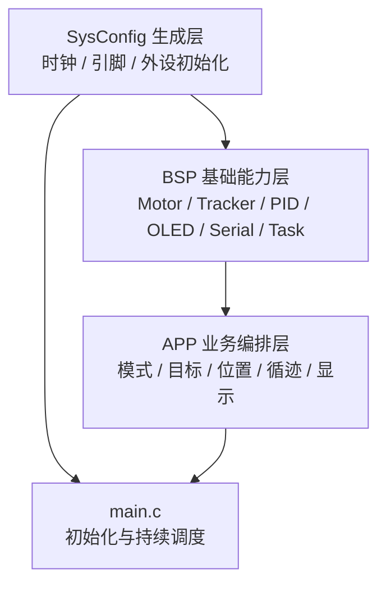

软件架构的价值不是让目录整齐，而是让新成员能回答：功能在哪里配置、数据由谁产生、状态由谁持有、故障该从哪一层查。本篇沿当前调用链说明这些职责。

| 文档属性 | 内容 |
| --- | --- |
| 文档编号 | TI-CAR-04 |
| 架构类型 | 裸机主循环 + 合作式周期调度 |
| 核心分层 | 生成配置 / BSP / APP |
| 关键约束 | 单线程、任务不可长时间阻塞 |

## 1. 三层职责

### 生成配置层

描述 MSPM0G35XX 的引脚、时钟和外设实例。它回答“硬件资源怎样分配”，不负责决定何时循迹或何时停车。

### BSP 层

把寄存器与引脚封装成可复用能力。例如 `Motor_SetDuty()` 接受带符号 PWM 命令，`Tracker_ReadRange()` 返回选定传感器范围内的偏差，`Task_Add()` 提供周期调度接口。

### APP 层

组合业务规则。`PositionControl_App` 产生定距目标速度，`TrackMode_App` 管理循迹阶段，`SpeedTarget_App` 处理速度斜坡和正常停车，`Task_App` 将它们编排进运行流程。

## 2. 启动顺序

`Task_Init()` 当前按以下顺序建立系统：

1. 启动电机 PWM 与 QEI，建立安全初值；
2. 初始化串口；
3. 设定位置控制默认模式；
4. 尝试初始化 OLED；
5. 初始化速度 PID；
6. 调用统一停机逻辑清空运行状态；
7. 按编译开关初始化可选模块；
8. 初始化中断；
9. 登记周期任务。

初始化顺序也是依赖关系。若把任务登记提前到状态和驱动初始化之前，主循环可能在系统尚未准备好时执行控制任务。

## 3. 当前任务表

| 优先级 | 任务 | 周期 | 责任 |
| ---: | --- | ---: | --- |
| 0 | Encoder | 10 ms | 读取 QEI，更新 RPM 与累计距离 |
| 1 | Tracker | 5 ms | 读取五路输入，更新偏差与终点模式 |
| 2 | ICM42688 | 20 ms | 仅在功能宏启用时登记 |
| 3 | TrackAuto | 20 ms | 仅在循迹自动启动宏启用时登记 |
| 4 | PID | 10 ms | 目标规划、闭环计算、PWM 输出 |
| 5 | Buzzer | 10 ms | 非阻塞提示脉冲 |
| 6 | Serial | 50 ms | 运行数据输出 |
| 7 | LED | 100 ms | 心跳指示 |
| 8 | OLED | 100 ms | 仅初始化成功时登记 |
| 9 | Key | 20 ms | 消抖、模式选择与中止 |

优先级数值越小越先执行，但这不是抢占优先级。一个先执行的任务若阻塞，后续任务仍会被整体推迟。

## 4. 调度器的时间模型

主循环持续调用 `Task_Start(Sys_GetTick)`。调度器检查到期任务，按照优先级和创建顺序执行。任务运行完成后才会返回主循环。

因此要遵守三个规则：

- 高频任务只做有界计算，不等待外设；
- 显示和日志限频，避免占用控制周期；
- 算法使用实际时间或明确的固定周期，不能把理想周期误当成事实。

`Task_Encoder()` 会计算两次执行间的实际毫秒数，并把它传给 `Motor_GetSpeed()`。这是对合作式调度抖动的必要防护。

## 5. 运行状态怎样流动

系统中既有业务状态，也有测量值：

| 类型 | 示例 | 主要所有者 |
| --- | --- | --- |
| 运行模式 | 循迹、定距、调试 | `ModeState_App`、`TrackMode_App` |
| 目标 | 左右目标 RPM、目标距离 | Position / Track / SpeedTarget |
| 测量 | 编码器 RPM、累计距离、循迹偏差 | Motor / Tracker 与周期任务 |
| 输出 | 左右 PWM、STBY、同步信号 | PID / Motor / Task_App |
| 观测 | OLED 页面、串口字段、蜂鸣状态 | Display / Serial / Task_App |

新增变量时，应先确定唯一所有者和更新周期。多个模块直接修改同一状态，会使复现和停机行为变得不可预测。

## 6. 统一停机是架构接口

`Task_StopAll()` 不是简单写零 PWM。它同时：

- 拉低外部运行同步信号；
- 停止位置控制；
- 清除运行模式与循迹阶段；
- 完成正常停车状态收口；
- 清零 PWM；
- 关闭蜂鸣脉冲状态。

按键中止、自动完成和异常停机都应汇聚到同一收口逻辑。若某个新功能绕过它直接返回，系统可能出现“电机停了但外部仍显示运行”的半停止状态。

## 7. 编译期开关的治理

当前 `Config_App.h` 使用宏管理 IMU、循迹自动启动、按键调试和直线调试。宏适合裁剪任务，但必须满足：

1. 默认值和用途有说明；
2. 非法组合在编译期报错；
3. 开关改变后执行完整构建与回归；
4. 发布记录包含实际宏配置。

宏关闭的代码仍可能逐渐失效。长期保留的可选功能应进入定期构建矩阵，否则就要明确降级为历史代码。

## 8. 新增功能的标准接入点

新增模块时按顺序回答：

1. SysConfig 是否需要新资源；
2. BSP 是否已有稳定接口；
3. APP 中谁拥有状态与策略；
4. 周期、优先级和最大执行时间是多少；
5. 如何观测健康状态；
6. 如何进入统一停机与错误降级；
7. 哪些回归测试会受到影响。

如果这七个问题没有答案，直接在 `Task_PID()` 或 `main.c` 中插入代码只会增加耦合。

## 本篇总结

- 当前软件由 SysConfig 生成层、BSP 能力层和 APP 业务层组成，职责边界比目录名称更重要。
- 系统使用单线程合作式调度，不是 RTOS；任务优先级决定到期后的先后顺序，不提供抢占能力。
- 编码器、循迹、控制、界面任务具有不同周期，阻塞输出会直接损害控制时序。
- 统一停机同时收口模式、目标、输出和外部状态，是必须复用的系统接口。

**上一篇：**[03｜硬件平台与安全上电](../03-first-motor-run/)

**下一篇：**[05｜电机执行链](../05-motor-execution-chain/)
