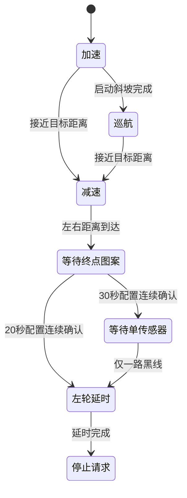

循迹不是“哪个探头黑就向哪转”的条件集合。当前实现把传感器图案转换为连续偏差，再经过滤波与 PD 生成左右速度差，同时用阶段状态机管理起步、巡航、减速和结束。

| 文档属性 | 内容 |
| --- | --- |
| 文档编号 | TI-CAR-08 |
| 采样周期 | 5 ms |
| 有效输入 | 逻辑第 4～8 路，共五路 |
| 输出 | 左右轮目标 RPM 修正量 |

## 1. 输入语义

当前有效传感器映射如下：

| 逻辑序号 | 引脚 | 相对位置 |
| ---: | --- | --- |
| 4 | PA12 | 左侧 |
| 5 | PA13 | 左中 |
| 6 | PA14 | 中心 |
| 7 | PA15 | 右中 |
| 8 | PA16 | 右侧 |

当前 `Tracker.c` 明确把低电平解码为黑线、高电平解码为白色。这个结论对应当前模块记录；换模块、改变比较器或上拉后，都必须重新做遮挡测试。

代码仍保留 12 个逻辑位置，未采样位置会被强制设为白色，避免旧接口或未连接引脚影响当前五路计算。

## 2. 从图案到位置偏差

在有效范围内，每个黑线传感器对应一个相对位置。多个探头同时检测黑线时，程序求这些位置的平均值，得到横向偏差。

中心第 6 路单独检测到黑线时，偏差被明确归零。没有任何传感器检测到黑线时，读取函数不产生新的有效偏差，系统会保留之前状态，因此丢线策略需要结合车辆行为单独验证。

## 3. 滤波与 PD 修正

原始偏差先通过一阶低通：

$$
e_f(k)=e_f(k-1)+\alpha[e(k)-e_f(k-1)]
$$

再计算滤波偏差的变化率，并形成转向修正：

$$
\Delta n = s\,(K_p e_f + K_d \dot e_f)\,G
$$

其中 $s$ 是转向符号，$G$ 是统一缩放。最终左右目标为：

$$
n_L=n_{L0}-\Delta n,\qquad n_R=n_{R0}+\Delta n
$$

代码还限制偏差变化率和转向修正，并在加速阶段按启动进度逐步放开修正，避免静止起步时突然产生很大差速。

## 4. 两套任务配置

当前工程维护 20 秒与 30 秒两套循迹配置。每套配置拥有独立的初始左右速度、PD 参数和左右目标距离。

这些名称是任务配置标识，不代表代码能够保证在任何场地都恰好用时 20 秒或 30 秒。实际完成时间受赛道、供电、轮胎、负载、标定和参数影响，必须以测试记录为准。

## 5. 阶段状态机

阶段职责如下：

- **加速**：两秒启动斜坡逐步提升基础速度和转向权限；
- **巡航**：按当前配置运行循迹 PD；
- **减速**：根据剩余距离限制左右基础速度；
- **等待终点图案**：以较低速度继续循迹并确认连续图案；
- **等待单传感器**：特定配置继续等待结束条件；
- **左轮延时**：按任务规则短时保持左侧动作，随后请求停止。

状态机把任务过程显式化，避免将距离、传感器和时间条件堆在一个巨大的 `if` 中。

## 6. 终点检测如何抗抖

当前终点区域关注逻辑第 5～7 路，先判断范围内是否存在相邻黑线，再要求连续满足 3 个采样周期。采样周期为 5 ms，因此配置层面的连续确认窗口约为 15 ms。

这只是软件抗抖条件，不能替代对标线宽度、车速和传感器安装高度的实测。若车速提高，同一空间标记在时间轴上的持续时间会缩短。

## 7. 标准调试顺序

1. 静止读取五路原始电平，确认黑白极性；
2. 依次遮挡每一路，核对物理左右与逻辑序号；
3. 手动横移车体，观察原始偏差符号和单调性；
4. 低速悬空或支撑测试左右目标修正方向；
5. 低速直线只调比例方向和量级；
6. 再评估滤波与微分，记录噪声和响应；
7. 单独验证加速、减速和终点图案；
8. 最后运行完整任务并统计多次结果。

如果第一步的左右顺序或电平极性错误，后面的参数调整没有意义。

## 8. 需要观察的字段

当前串口输出链能够提供原始偏差、滤波偏差、偏差变化率、转向修正、左右目标 RPM、滤波实际 RPM 和左右 PWM。这些字段构成一条足以诊断大多数循迹问题的时间序列。

| 现象 | 从数据判断 |
| --- | --- |
| 越偏修正越错 | 偏差符号或转向符号错误 |
| 直线快速摆动 | 增益过高、滤波不足或机械间隙 |
| 转弯跟不上 | 基础速度过高、修正限幅过小 |
| 终点漏检 | 图案、采样、速度或确认条件不匹配 |
| 提前结束 | 终点图案与普通弯道不可区分 |

## 本篇总结

- 当前循迹主流程只使用逻辑第 4～8 路五个输入，并把低电平解释为检测到黑线。
- 传感器图案先转换为连续位置偏差，再经过低通和 PD 形成左右轮目标速度差。
- 20 秒与 30 秒是两套独立任务配置，不是对完成时间的无条件承诺。
- 加速、巡航、减速、终点确认与停止由显式状态机管理，调试时应逐阶段验证而非只跑完整赛道。

**上一篇：**[07｜速度与位置控制](../07-speed-position-control/)

**下一篇：**[09｜人机交互与可观测性](../09-observability-and-hmi/)
