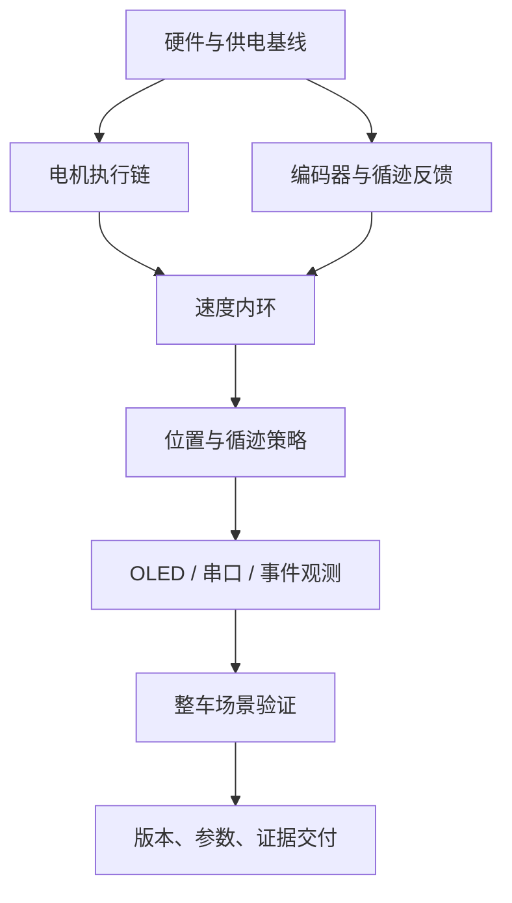

前九篇把系统拆开，本篇把它重新组合。整车联调不是“把所有功能同时打开试试看”，而是让每一层带着证据进入下一层，并在失败时能够快速回退到最近的可信基线。

| 文档属性 | 内容 |
| --- | --- |
| 文档编号 | TI-CAR-10 |
| 文档类型 | 系统集成 / 验证 / 交付 |
| 输入 | 已通过单模块验证的硬件与固件 |
| 输出 | 可复现固件、测试证据、已知限制、交接包 |

## 1. 回到整车架构

任一层不可信，都不应通过调高控制参数来跨越。例如编码器符号未确认时，速度闭环测试没有意义；正常停车未验证时，完整赛道计时也不是合格交付。

## 2. 集成闸门

### G0：配置与构建

- 工程、工具链和宏配置已记录；
- SysConfig 无未解释的资源冲突；
- 全量构建成功，警告已评审；
- 固件映像可追溯到源码提交。

### G1：电气与静态状态

- 电源极性、电压、共地和电平边界已确认；
- 车轮悬空，上电 PWM 为零；
- `STBY`、外部同步和状态显示处于安全初态。

### G2：执行与反馈

- 左右正负命令和机械方向一致；
- 正向车轮运动产生正 RPM；
- 静止计数稳定；
- 单轮和双轮运行不导致 MCU 复位。

### G3：速度与位置

- 多个 RPM 目标下稳定跟随；
- PWM 不长期无解释地饱和；
- 定距能够进入细调并满足停稳条件；
- 中止和正常完成都进入统一停机。

### G4：循迹与任务状态

- 五路顺序、极性、偏差方向正确；
- 加速、巡航、减速和终点阶段可分别复现；
- 20 秒与 30 秒配置互不污染；
- 完整任务多次运行结果有统计记录。

### G5：交付回归

- 冷启动、重复启动、低电量和长时间运行已覆盖；
- 显示或非关键外设失效时降级合理；
- 交付包、恢复步骤和已知限制完整。

## 3. 最小回归矩阵

| 编号 | 场景 | 关键判定 |
| --- | --- | --- |
| R01 | 上电空闲 | 电机静止、状态 IDLE、PB13 低 |
| R02 | 左右单轮正反 | 方向、PWM、RPM 符号一致 |
| R03 | 双轮固定转速 | 目标跟随、无持续饱和 |
| R04 | 相对定距 | 进入细调、停稳、完成提示 |
| R05 | 运行中中止 | 模式和输出全部收口 |
| R06 | 五路静态扫描 | 顺序、极性、偏差单调 |
| R07 | 低速循迹 | 修正方向正确、无发散 |
| R08 | 终点图案 | 连续确认与阶段切换正确 |
| R09 | 完整 20 秒配置 | 参数隔离、任务完成可重复 |
| R10 | 完整 30 秒配置 | 等待单传感器阶段可重复 |
| R11 | OLED 断开 | 控制链可降级，问题可识别 |
| R12 | 重复运行 | 上次状态、积分和计数不残留 |

“通过”必须对应量化阈值或明确观察。比如“直线效果不错”不如“在指定距离内横向偏差不超过约定范围，并附测试数据”。具体性能阈值需要团队根据任务要求和实测能力制定，当前源码不能替团队臆定。

## 4. 故障隔离路径

### 车不动

按供电 → STBY → PWM → 方向 GPIO → 电机接线 → 机械卡滞检查。不要先查循迹或 PID。

### 车一闭环就失控

按目标符号 → 编码器符号 → RPM 单位 → 实际周期 → PWM 限幅检查。先用低目标和悬空单轮复现。

### 能直行但循迹反向

检查传感器左右顺序、黑白极性、偏差符号和转向符号。保持速度 PID 参数不变。

### 到终点不停

区分距离阶段未到、终点图案未确认、状态未切换、停止请求未消费和停稳条件未满足。串口事件与 OLED 状态应能定位具体阶段。

### 偶发复位

优先测量电源压降、地弹、电机干扰和多路供电，再检查栈、越界和阻塞。不要仅因“改软件后出现”就排除硬件原因。

## 5. 参数治理

参数应按域维护：

| 参数域 | 示例 | 变更验证 |
| --- | --- | --- |
| 机械与反馈 | 每圈计数、cm/count、极性 | 手转、定长标定 |
| 执行 | PWM 量程、输出极性 | 波形、单轮测试 |
| 速度控制 | 前馈、PID、滤波、死区 | 阶跃与稳态曲线 |
| 位置控制 | 比例、上限、细调、容差 | 多距离往返 |
| 循迹 | 滤波、PD、转向限幅 | 标准路线与扰动 |
| 任务阶段 | 距离、速度、确认次数、延时 | 完整流程回归 |

每次提交只聚焦一个参数域。若确需联动修改，要在变更说明中写出因果关系和回退方案。

## 6. 交付包应包含什么

1. 可构建源码与提交号；
2. 工具链和构建配置；
3. 可下载固件及校验值；
4. 硬件版本、改线和接口方向图；
5. 参数快照与单位说明；
6. 测试矩阵、原始数据和结论；
7. 已知限制、未验证项与风险；
8. 上电、启动、停止和恢复步骤；
9. 日志字段表与故障码说明；
10. 负责人和变更记录。

交付不是只发送一个工程压缩包。没有环境、硬件和参数上下文，后续成员即使成功编译，也无法确认行为是否等同。

## 7. 专题知识闭环

完成本系列后，应能从任何一个现象回溯信息链：

- 从车轮动作回到 PWM、方向和目标；
- 从目标回到位置、循迹和任务状态；
- 从反馈回到 QEI、周期和标定；
- 从异常回到电源、配置、调用与上板证据；
- 从一次成功回到可重复的版本、参数与测试记录。

这就是“整体—部分—整体”的最后一步：拆开系统不是目的，能够带着清晰边界重新组合并交付，才是工程能力。

## 本篇总结

- 整车集成应经过配置、电气、执行反馈、闭环、循迹和交付闸门，每层通过后再进入下一层。
- 回归矩阵必须覆盖安全初态、正反方向、速度、定距、中止、循迹阶段、降级和重复运行。
- 故障定位沿信息链回退，避免同时修改硬件、参数和状态逻辑。
- 最终交付必须绑定源码、固件、硬件、参数、测试证据和已知限制，才能让下一位成员可靠复现。

**上一篇：**[09｜人机交互与可观测性](../09-observability-and-hmi/)

**返回专题起点：**[01｜TI 小车专题总览](../01-ti-car-start/)
